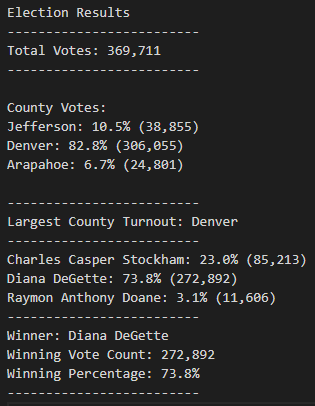

# Election_Analysis
## Overview of Election Audit

### Project Overview
A Colorado Board of Elections employee has given you the following tasks to complete the election audit of a recent local congressional election.

1. Calculate the total number of votes cast.
2. Get a complete list of counties with voters.
3. Calculate the total number of votes from each county.
4. Calculate the percentage of the total votes for each county.
5. Determine the county with the largest turnout.
6. Get a complete list of candidates who received votes.
7. Calculate the total number of votes each candidate received.
8. Calculate the percentage of votes each candidate won.
9. Determine the winner of the election based on popular vote.

### Resources
- Data Source: election_results.csv
- Software: Python 3.10.5, Visual Studio Code 1.67.2

## Election Audit Results

### Election Outcomes

The analysis of the election shows that:
- There were *369,711* votes cast in the election.
- The counties were:
    - Jefferson
    - Denver
    - Arapahoe
- The county turnouts were:
    - Jefferson received *10.5% of the vote and *38,855* number of votes.
    - Denver received *82.8% of the vote and *306,055* number of votes.
    - Arapahoe received *6.7% of the vote and *24,801* number of votes.
- Denver had the largest county turnout of *306,055*.
- The candidates were:
    - Charles Casper Stockham
    - Diana DeGette
    - Raymon Anthony Doan
- The candidate results were:
    - Charles Casper Stockham reveived *23.0%* of the vote and *85,213* number of votes.
    - Diana DeGette reveived *73.8%* of the vote and *272,892* number of votes.
    - Raymon Anthony Doane reveived *3.1%* of the vote and *11,606* number of votes.

## Election Audit Summary

### Statement to the election commission

Explore how this script can be used for any election with 2 examples for modifications